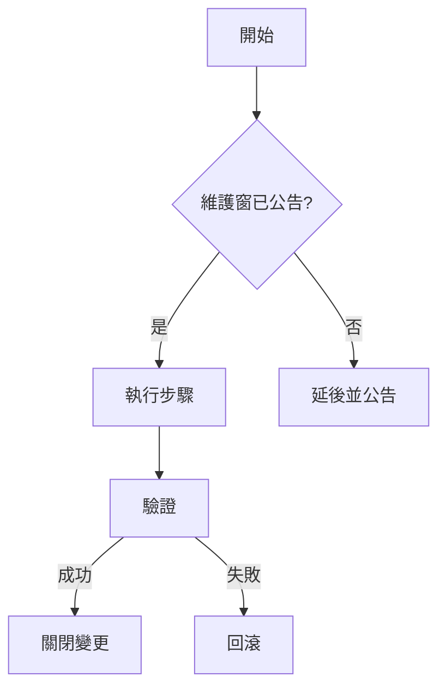

# 任務名稱（簡要描述）

## 1. 前置檢查
- [ ] 權限 / 維護窗 / 變更單
- [ ] 必要參數（Parameter Store 路徑、KMS Key 等）
- [ ] 風險與影響評估

## 2. 操作步驟
1. ……
2. ……

## 3. 驗證
- [ ] 指標 / 日誌 / 端到端測試

## 4. 回滾
- 方案 A：……
- 方案 B：……

## 5. 記錄
- 變更單編號 / 審批人 / 執行人
- CloudTrail / SSM 執行紀錄連結

## 流程圖（Mermaid 範例，可刪）
